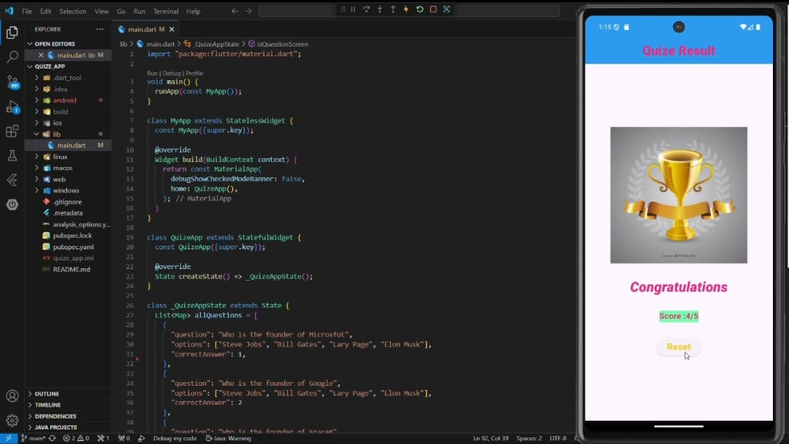

# Quize App

A modern **Flutter** Quiz Application. This project lets users take topic‑wise quizzes, tracks scores, supports timers, and provides instant feedback with explanations. Built with Flutter and Dart for **Android**, **iOS**, **Web**, and **Desktop**.

> Project ID: `quize_app`  
> Flutter SDK: `>=3.4.4 <4.0.0`

---

## ✨ Features
- Multiple‑choice questions with single/multi‑select (configurable)
- Timed quizzes with progress and per‑question timer
- Score summary with correct/incorrect review
- Local state persistence (resume quiz)
- Theming (light/dark) and responsive UI
- Ready for Web (Flutter web) and mobile builds
- Simple JSON‑based question bank for easy authoring

---

## 📦 Tech Stack
- **Flutter** (Dart)
- **Material 3** components
- **State management:** `setState` / basic providers (swap in your favorite)
- **Unit/UI testing:** `flutter_test`

### Dependencies (from `pubspec.yaml`)
```yaml
dependencies:
flutter:
  sdk: flutter

dev_dependencies:
flutter_test:
  sdk: flutter
flutter_lints: ^3.0.0
```

---

## 🚀 Getting Started

### 1) Prerequisites
- [Flutter SDK](https://docs.flutter.dev/get-started/install) installed and on your PATH
- An emulator/simulator or a physical device connected (`adb devices` / Xcode simulator)
- Optional: Chrome for web

Verify setup:
```bash
flutter --version
flutter doctor
```

### 2) Clone & Install
```bash
git clone <your-repo-url>.git
cd quize_app
flutter pub get
```

### 3) Run
Android/iOS:
```bash
flutter run
```
Web:
```bash
flutter run -d chrome
```
Desktop (where supported):
```bash
flutter run -d windows   # or macos/linux
```

### 4) Build
Android APK:
```bash
flutter build apk --release
```
Web (to `build/web/`):
```bash
flutter build web
```

---

## 📁 Project Structure
```
quize_app/
├─ lib/
│  ├─ main.dart                # App entry
│  ├─ screens/                 # UI screens (Home, Quiz, Result)
│  ├─ widgets/                 # Reusable widgets (QuestionCard, Timer, Options)
│  ├─ models/                  # Data models (Question, Option)
│  ├─ services/                # Data loading (JSON), scoring logic
│  └─ theme/                   # Colors, text styles
├─ assets/
│  ├─ questions/               # JSON files for quizzes
│  └─ images/                  # App images (optional)
├─ test/                       # Unit & widget tests
├─ pubspec.yaml                # Dependencies & assets
└─ README.md
```
> Note: Your current repository may not yet include all these folders—feel free to create them as you modularize the code.

---

## 🧪 Sample Question Format
Create JSON files under `assets/questions/` and register the folder in `pubspec.yaml`:
```json
[
  {
    "id": "q1",
    "question": "Which of the following are programming languages?",
    "options": ["Python", "HTML", "CSS", "Dart"],
    "answerIndex": [0, 3],
    "explanation": "Python and Dart are languages; HTML/CSS are markup/style."
  }
]
```
Update `pubspec.yaml`:
```yaml
flutter:
  uses-material-design: true
  assets:
    - assets/questions/
```

---

## ⚙️ Configuration
- **Timer per question:** configurable in `lib/services/quiz_config.dart`
- **Randomization:** toggle shuffle for questions & options
- **Passing score:** set threshold in `lib/services/scoring.dart`
- **Theme:** edit in `lib/theme/`

---

## 🧰 Scripts
Helpful dev commands:
```bash
flutter analyze
flutter test
flutter gen-l10n
```

---

## 🐞 Troubleshooting
- **Gradle/AndroidX issues:** run `flutter clean && flutter pub get`
- **iOS codesign:** open `ios/Runner.xcworkspace` in Xcode and set a team
- **Web CORS or service worker:** clear browser cache; ensure `flutter build web` output is served correctly
- **Device not found:** `adb devices` (Android) or use Xcode simulator (iOS)

---

---

## 🖼️ Screenshots
Add UI screenshots to `assets/images/` and showcase them here:
```
.jpg)
.jpg)


```

---

## 🙌 Acknowledgements
- Flutter team & community
- Icons/illustrations used under their respective licenses
